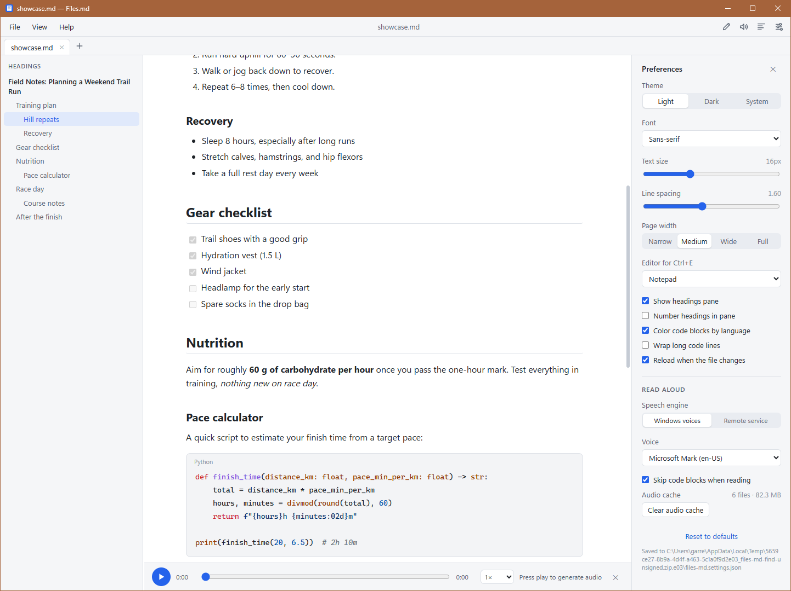

# Files.md

A clean, portable Markdown reader for Windows. One `.exe`, no installer.

<picture>
  <source media="(prefers-color-scheme: dark)" srcset="docs/screenshot-dark.png">
  <source media="(prefers-color-scheme: light)" srcset="docs/screenshot-light.png">
  
</picture>

- **Readable by default:** light, dark, or match Windows; adjustable font, text size, line spacing, and page width
- **Headings pane:** jump to any heading, current section highlighted as you scroll
- **Find in document:** Ctrl+F searches the whole text, with every match highlighted
- **Opens how you'd expect:** double-click a `.md` file, drag files onto the window, or File → Open
- **Tabs and windows:** open several files at once; files opened from Explorer become tabs in the running app instead of new copies. Right-click a tab and choose **Move to new window** to give it its own window; settings stay in sync across windows
- **Code that's easy to read:** syntax colors for 40+ languages, with a one-click Copy button
- **Read aloud:** listen to any document using Windows' built-in voices (offline), or an optional remote speech service. Audio is cached, so replaying is instant
- **Print / Save as PDF:** clean printouts in light colors, without the app's menus and panes
- **Edit in your editor:** Ctrl+E opens the file in Notepad, VS Code, Notepad++, or any editor you pick
- **Auto-reload:** re-renders when the file changes on disk, so edits show up as you save
- **Portable:** settings are saved to `files-md.settings.json` next to the exe (or in your AppData folder if that folder isn't writable)

## Download

Grab `files-md.exe` from [Releases](https://github.com/garrettds11/files-md/releases) and put it anywhere. It uses Microsoft Edge WebView2, which ships with Windows 10 and 11.

### Make it your default Markdown reader

1. Right-click any `.md` file → **Open with** → **Choose another app**
2. **Choose an app on your PC** → browse to `files-md.exe`
3. Click **Always**

## Keyboard shortcuts

**Files, tabs, and windows**

| Keys | Action |
|---|---|
| `Ctrl+O` | Open file(s) |
| `Ctrl+W` | Close tab |
| `Ctrl+Tab` / `Ctrl+Shift+Tab` | Next / previous tab |
| `Ctrl+1`…`Ctrl+9` | Go to tab (9 = last) |
| `Ctrl+N` | New window |
| `Ctrl`+click a link | Open the linked `.md` file in a new tab |
| `F5` | Reload |

**Reading**

| Keys | Action |
|---|---|
| `Ctrl+F` | Find in document |
| `Enter` / `Shift+Enter` (or `F3` / `Shift+F3`) | Next / previous match |
| `Ctrl+B` | Show / hide headings pane |
| `Ctrl+=` / `Ctrl+-` / `Ctrl+0` | Text size |
| `Ctrl+Shift+U` | Read aloud (`Space` to play / pause) |

**Tools**

| Keys | Action |
|---|---|
| `Ctrl+E` | Edit in your editor (Notepad, VS Code, Notepad++, or any .exe, set in Preferences) |
| `Ctrl+P` | Print / Save as PDF |
| `Ctrl+,` | Preferences |
| `Esc` | Close find, menus, or Preferences |

## Building

Requires [Node.js](https://nodejs.org) LTS and [Rust](https://rustup.rs).

```powershell
npm install
npm run tauri dev                    # run with hot reload
npx tauri build --no-bundle          # portable exe -> src-tauri/target/release/files-md.exe
```

Releases are built by GitHub Actions. To release, bump `version` in `src-tauri/tauri.conf.json` (and `package.json` / `src-tauri/Cargo.toml`) and push to `main`. The workflow builds `files-md.exe`, creates the `v<version>` tag, and publishes the release.

## Code signing

Free code signing provided by [SignPath.io](https://about.signpath.io), certificate by [SignPath Foundation](https://signpath.org).

## Privacy

Files.md collects no data. It makes no network requests of its own and has no telemetry, analytics, or update checks. It only reads the files you open, and it stores your preferences in `files-md.settings.json` next to the exe on your own computer. Links in a document open in your web browser only when you click them, and remote images in a document are loaded from their websites when shown.

**Read aloud.** By default, read aloud uses the voices built into Windows and runs entirely on your computer; nothing is sent anywhere. If you choose **Remote service** in Preferences, the text of the document you're listening to is sent to the speech endpoint you configure (for example, OpenAI), and that provider's privacy policy applies. Remote speech is off unless you turn it on. Your API key is stored in plain text in the settings file. Generated audio is cached in `%LOCALAPPDATA%\io.github.garrettds11.filesmd\tts-cache`, named by an MD5 hash of the text and voice settings; clear it any time from Preferences.

## License

[MIT](LICENSE)
