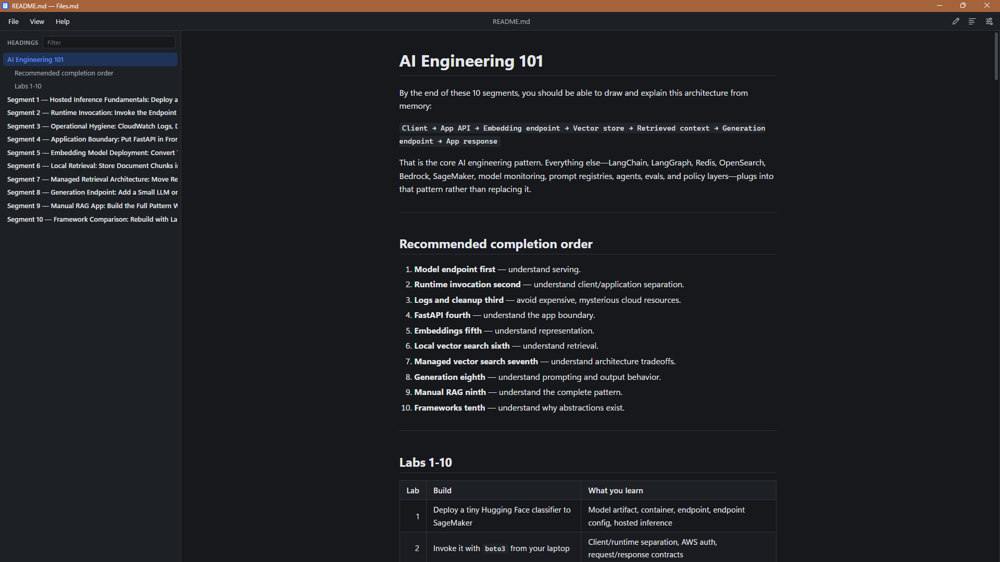

# Files.md

A clean, portable Markdown reader for Windows. One `.exe`, no installer.



- **Readable by default:** light, dark, or match Windows; adjustable font, text size, line spacing, and page width
- **Headings pane:** jump to any heading, filter headings, current section highlighted as you scroll
- **Opens how you'd expect:** double-click a `.md` file, drag a file onto the window, or File → Open
- **Edit in your editor:** Ctrl+E opens the file in Notepad, VS Code, Notepad++, or any editor you pick
- **Auto-reload:** re-renders when the file changes on disk, so edits show up as you save
- **Portable:** settings are saved to `files-md.settings.json` next to the exe

## Download

Grab `files-md.exe` from [Releases](https://github.com/garrettds11/files-md/releases) and put it anywhere. It uses Microsoft Edge WebView2, which ships with Windows 10 and 11.

### Make it your default Markdown reader

1. Right-click any `.md` file → **Open with** → **Choose another app**
2. **Choose an app on your PC** → browse to `files-md.exe`
3. Click **Always**

## Keyboard shortcuts

| Keys | Action |
|---|---|
| `Ctrl+O` | Open file |
| `Ctrl+E` | Edit in your editor (Notepad, VS Code, Notepad++, or any .exe — set in Preferences) |
| `F5` | Reload |
| `Ctrl+B` | Toggle headings pane |
| `Ctrl+,` | Preferences |
| `Ctrl+F` | Filter headings |
| `Ctrl+=` / `Ctrl+-` / `Ctrl+0` | Text size |

## Building

Requires [Node.js](https://nodejs.org) LTS and [Rust](https://rustup.rs).

```powershell
npm install
npm run tauri dev                    # run with hot reload
npx tauri build --no-bundle          # portable exe -> src-tauri/target/release/files-md.exe
```

Releases are built by GitHub Actions. To release, bump `version` in `src-tauri/tauri.conf.json` (and `package.json` / `src-tauri/Cargo.toml`) and push to `main`. The workflow builds `files-md.exe`, creates the `v<version>` tag, and publishes the release.

## Code signing

Free code signing provided by [SignPath.io](https://about.signpath.io), certificate by [SignPath Foundation](https://signpath.org).

## Privacy

Files.md collects no data. It makes no network requests of its own and has no telemetry, analytics, or update checks. It only reads the files you open, and it stores your preferences in `files-md.settings.json` next to the exe on your own computer. Links in a document open in your web browser only when you click them, and remote images in a document are loaded from their websites when shown.

## License

[MIT](LICENSE)
